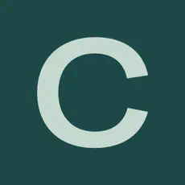
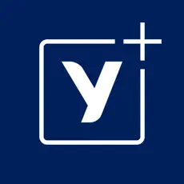
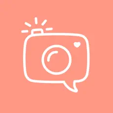
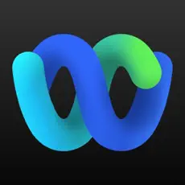

# Hi 👋, I'm Nitin, let's connect     

### 🚀 Mobile & Frontend Developer  

💼 I’m currently working at [Yara](https://yaraplus.de/)  
⚡  I specialise in building **user-friendly and performan mobile applications**   
✉️ Reach me at **ndpiparava@gmail.com**  

---
<table>
<tr>
<td width="50%" valign="top">

**🛠️ Languages & Tools**  

  
  
  
  

**🎨Design & Architecture Patterns**   
`MVP` `VIP` `MVVM` `Atomic Design` `TCA`  

**📱Frameworks & Libraries**    

  
  
  
  
  

**🔄 State Management**    
- Zustand  
- Redux 

</td>
<td width="50%" valign="top">

**🔗 APIs & Data**    

  
  
  

**🧪 Testing** 
 
 

**⚙️ DevOps & CI/CD**    

  
  
  
  

**☁️ Cloud & Services**    

  
  

**📰 CMS & Platforms**    

  
  

</td>
</tr>
</table>

----
### 📱 Projects

     
